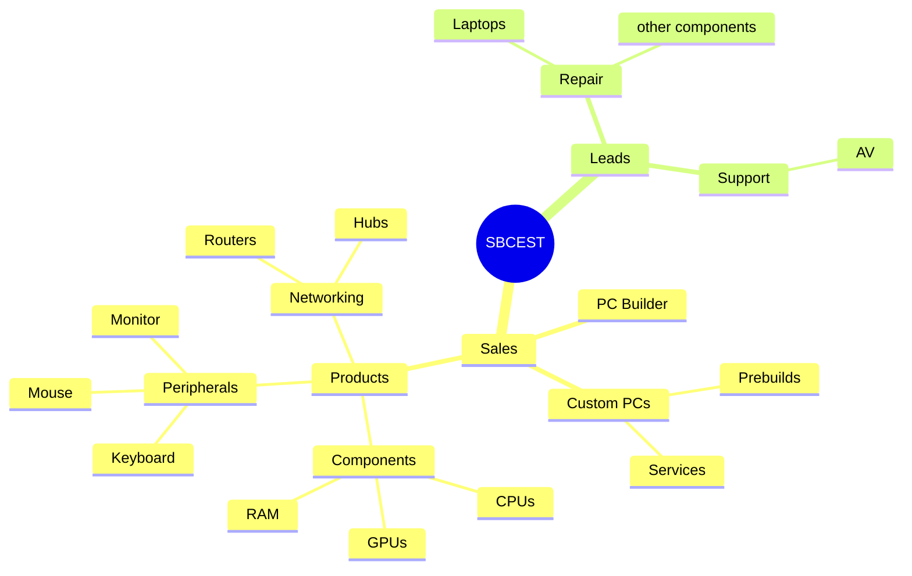

# SBCEST COMMERCE
## Technical requirements
- **Product catalog**
  - components (CPUs, GPUs, RAM, etc.)
  - gaming and common segments
  - filters brand, price, specs
  - **Priority: High**

- **E-Commerce**
  - Shopping cart
  - Checkout for parts & custom PCs
  - **Priority: High**

- **Custom Prebuilds & Services**
  - Pre-assembled PC options
  - Assembly/upgrade services

- **Repair shop booking**
  - Laptop repair scheduling
  - Status tracking

- **Lead Generation**
  - AV products
  - Step-up support packages
  - Quote/contact forms only
  - **Priority: Medium**

- **User system**
  - Dashboards
  - Tracking api (intergration if possible)
  - Cancelation etc
  - Save/share builds
  - Order history
  - Invoice printing on site instead of mailing receipts
  - **Priority: High**

- **PC builder tool**
  - Interactive part selection
  - Real-time compatibility checks
  - Price estimation
  - Build export/share
  - **Priority: low**

-**Payment Gateway**
  -Moyasar 
  -checkin
  -confermation
  - Use something other than just the sandbox of Moyasar

-**Search and Filter Options**
 -Price
 -Brands 
 -Specs 
 -Features

-**CMS**
 -Other than basic updation of categories and products add specifics
## Non-Functional

- make A+ content live 
- Make banners and static effect that can be controlled with the CMS
- Soft Deletion of select data
-

---

## Product Categories Mind Map


#Enviornment and Stacks used 
>next.js
>react 18
>TS5
>Tailwind 3
- **tailwindcss-animate** 
- **clsx** + **tailwind-merge**
- **class-variance-authority (cva)** 

>UI Components
- **Radix UI** 
- **Lucide React** – Icons 
- **Heroicons** –icons
- **Tabler Icons React** – icons
- **React Slick** – /slider
- **Swiper** – Touch slider
- **CMDk** – Command palette (like Spotlight)

>States and managements 
- **Redux Toolkit**
- **React Redux**

- **React Hook Form** –forms
- **Zod** – schema validation

> Authentication
- **Clerk** – Full auth solution:
  - `@clerk/nextjs` (frontend)
  - `@clerk/clerk-sdk-node` (backend)
  - User management, sessions, SSO

> Database & ORM
- **Prisma 5**
- ** Mongo Db**

>Email
- **Resend** 
- **React Email** 
- **@react-email/components** 

>Utilities
- **AWS S3**
- **moysar** PAYMENT 
- **dotenv**
- **uuid**
- **slugify** – URL-friendly strings
- **sharp** – Image processing
- **framer-motion**
- **react-confetti**
- **cobe**
- **react-intersection-observer**
- **react-responsive**
- **react-hot-toast**

> Internationalization
- **next-intl** – i18n 
```
#Components and  workflow 
##middleware.ts
#
```typescript
import { authMiddleware } from "@clerk/nextjs";
import createMiddleware from "next-intl/middleware";

```
intlMiddleware creates a international that take the function from the black box next-intl/middleware and specifies the internationalizations to arabic or english. default bging 
runIntFirst makes sure that you run intl and also specificy what all to skip this could be optionally assigned to another function. 
```typescript
const skipIntl =
    req.nextUrl.pathname.startsWith("/_next") ||     // Next.js internals
    req.nextUrl.pathname.includes("/api/") ||        // All API routes
    req.nextUrl.pathname.startsWith("/cms") ||       // CMS paths
    /\.\w+$/.test(req.nextUrl.pathname);       

```
there are public routes that can be used by unauthorized users 
```typescript
publicRoutes: [
    "/",                           // Root → becomes /ar or /en
    "/products",                   // Clean paths (intl strips locale)
    "/cart",
    "/products/[id]",
    "/products/[id]/[slug]",
    "/gaming",
    "/gaming/products",
    "/sign-in",               
    "/sign-up",
    "/api/products/search-by-name/[term]", 
  ],
  ```
  and ignorindg some
  these are moysar payment and signin and sigup again 
the  authMiddleware takes clerk and call rubnIntl 
---
>next.config.js
this enables plugins mainly the i18n

and also allows images and cdn from select URLS

cms.config.ts also does this but for the cdn from sbcest.com
---
```
#the file system layout
├── app
│   ├── api
│   │   ├── email
│   │   │   └── route.ts
│   │   ├── payment
│   │   │   └── moyasar
│   │   │       ├── route.ts
│   │   │       └── webhook
│   │   │           └── route.ts
│   │   └── products
│   │       ├── [id]
│   │       │   └── route.ts
│   │       ├── route.ts
│   │       └── search-by-name
│   │           └── [name]
│   │               └── route.ts
│   ├── cms
│   │   └── (cms)
│   │       ├── about
│   │       │   └── page.tsx
│   │       ├── categories
│   │       │   ├── [id]
│   │       │   │   └── page.tsx
│   │       │   └── page.tsx
│   │       ├── error.tsx
│   │       ├── layout.tsx
│   │       ├── loading.tsx
│   │       ├── orders
│   │       │   ├── columns.tsx
│   │       │   ├── [id]
│   │       │   │   └── page.tsx
│   │       │   └── page.tsx
│   │       ├── page.tsx
│   │       ├── products
│   │       │   ├── columns.tsx
│   │       │   ├── [id]
│   │       │   │   └── page.tsx
│   │       │   ├── new
│   │       │   │   └── page.tsx
│   │       │   └── page.tsx
│   │       └── users
│   │           └── page.tsx
│   ├── favicon.ico
│   ├── globals.css
│   ├── layout.tsx
│   ├── [locale]
│   │   └── (store)
│   │       ├── cart
│   │       │   └── page.tsx
│   │       ├── category
│   │       │   └── [id]
│   │       │       ├── loading.tsx
│   │       │       └── page.tsx
│   │       ├── checkout
│   │       │   └── page.tsx
│   │       ├── custom-slider.css
│   │       ├── dashboard
│   │       │   ├── loading.tsx
│   │       │   └── page.tsx
│   │       ├── dynamic.tsx
│   │       ├── fonts.ts
│   │       ├── gaming
│   │       │   ├── categories
│   │       │   │   ├── case
│   │       │   │   │   └── page.tsx
│   │       │   │   ├── coolers
│   │       │   │   │   └── page.tsx
│   │       │   │   ├── gamingpc
│   │       │   │   │   └── page.tsx
│   │       │   │   ├── gpu
│   │       │   │   │   └── page.tsx
│   │       │   │   ├── motherboards
│   │       │   │   │   └── page.tsx
│   │       │   │   ├── powersupplies
│   │       │   │   │   └── page.tsx
│   │       │   │   ├── processors
│   │       │   │   │   └── page.tsx
│   │       │   │   └── ram
│   │       │   │       └── page.tsx
│   │       │   ├── page.tsx
│   │       │   └── products
│   │       │       ├── [id]
│   │       │       │   ├── loading.tsx
│   │       │       │   └── page.tsx
│   │       │       ├── loading.tsx
│   │       │       └── page.tsx
│   │       ├── layout.tsx
│   │       ├── local-fonts.ts
│   │       ├── order-complete
│   │       │   └── page.tsx
│   │       ├── page.tsx
│   │       ├── privacy
│   │       │   └── page.tsx
│   │       ├── products
│   │       │   ├── [id]
│   │       │   │   ├── loading.tsx
│   │       │   │   ├── [slug]
│   │       │   │   │   └── page.tsx
│   │       │   │   └── temp-page.tsx
│   │       │   ├── loading.tsx
│   │       │   └── page.tsx
│   │       └── returns
│   │           └── page.tsx
│   ├── not-found.tsx
│   ├── sign-in
│   │   └── [[...sign-in]]
│   │       └── page.tsx
│   └── sign-up
│       └── [[...sign-up]]
│           └── page.tsx
├── cms.config.ts
├── components
│   ├── cms
│   │   ├── CardContent.tsx
│   │   ├── CategoryForm.tsx
│   │   ├── CategoryItems.tsx
│   │   ├── Category.tsx
│   │   ├── ErrorCms.tsx
│   │   ├── Header.tsx
│   │   ├── ImageUploader.tsx
│   │   ├── Loader.tsx
│   │   ├── OrderDetails.tsx
│   │   ├── OrderForm.tsx
│   │   ├── OrderTable.tsx
│   │   ├── PaymentTable.tsx
│   │   ├── ProductForm.tsx
│   │   ├── RenderingPageSkeleton.tsx
│   │   ├── SelectCategory.tsx
│   │   ├── SideMenuLink.tsx
│   │   ├── SideNavBar.tsx
│   │   └── UploadedImage.tsx
│   ├── store
│   │   ├── AddToCart.tsx
│   │   ├── aplus.tsx
│   │   ├── AppleBanner.tsx
│   │   ├── asus_bento.tsx
│   │   ├── Banner.tsx
│   │   ├── BestSeller.tsx
│   │   ├── CartContainer.tsx
│   │   ├── CartIcon.tsx
│   │   ├── CartItem.tsx
│   │   ├── categoryproductlist.tsx
│   │   ├── catgrid.tsx
│   │   ├── catproducts
│   │   ├── CheckoutForm.tsx
│   │   ├── DashboardHeader.tsx
│   │   ├── DefaultCategoriesList.tsx
│   │   ├── Dhabahspecs.tsx
│   │   ├── dhahab_featured.tsx
│   │   ├── dhahab_header.tsx
│   │   ├── dhahab_hero.tsx
│   │   ├── dhahab_video.tsx
│   │   ├── DynamicFrameLayout.tsx
│   │   ├── DynamicUserIcon.tsx
│   │   ├── FeatureCard.tsx
│   │   ├── FeaturedProducts.tsx
│   │   ├── FilterOption.tsx
│   │   ├── Footer.tsx
│   │   ├── FrameComponent.tsx
│   │   ├── gaminghero.tsx
│   │   ├── gamingList.tsx
│   │   ├── HeroBanner.tsx
│   │   ├── Hero.tsx
│   │   ├── InvoiceCard.tsx
│   │   ├── InvoiceContainer.tsx
│   │   ├── InvoiceFormSkeleton.tsx
│   │   ├── InvoiceSkeleton.tsx
│   │   ├── Invoice.tsx
│   │   ├── LanguageSwitcher.tsx
│   │   ├── Logitech.tsx
│   │   ├── LogoCloud.tsx
│   │   ├── Logo.tsx
│   │   ├── MacVid.tsx
│   │   ├── mice-keyboard.tsx
│   │   ├── Moyasar.tsx
│   │   ├── NavBar.tsx
│   │   ├── OrderCard.tsx
│   │   ├── PaymentFailed.tsx
│   │   ├── PaymentSuccess.tsx
│   │   ├── pc.tsx
│   │   ├── ProductCardGaming.tsx
│   │   ├── ProductCard.tsx
│   │   ├── ProductDetailsCarousel.tsx
│   │   ├── ProductDetails.tsx
│   │   ├── ProductGrid.tsx
│   │   ├── ProductListgaming.tsx
│   │   ├── ProductList.tsx
│   │   ├── ReduxProvider.tsx
│   │   ├── RelatedProducts.tsx
│   │   ├── SearchContainerBackup.tsx
│   │   ├── SearchContainer.tsx
│   │   ├── SkeletonProductList.tsx
│   │   ├── StyleCard.tsx
│   │   ├── Support.tsx
│   │   ├── Trackbar.tsx
│   │   ├── video-conference.tsx
│   │   ├── WobbleCard.tsx
│   │   └── Wrapper.tsx
│   ├── theme-provider.tsx
│   └── ui
│       ├── accordion.tsx
│       ├── alert-dialog.tsx
│       ├── alert.tsx
│       ├── avatar.tsx
│       ├── badge.tsx
│       ├── bento-grid.tsx
│       ├── button.tsx
│       ├── card.tsx
│       ├── checkbox.tsx
│       ├── command.tsx
│       ├── dialog.tsx
│       ├── dropdown-menu.tsx
│       ├── form.tsx
│       ├── input.tsx
│       ├── label.tsx
│       ├── nav.tsx
│       ├── radio-group.tsx
│       ├── scroll-area.tsx
│       ├── select.tsx
│       ├── separator.tsx
│       ├── sheet.tsx
│       ├── skeleton.tsx
│       ├── slider.tsx
│       ├── switch.tsx
│       ├── table.tsx
│       ├── tabs.tsx
│       ├── textarea.tsx
│       ├── tooltip.tsx
│       └── wobble-card.tsx
├── components.json
├
├── emails
│   └── index.tsx
├── i18n.ts
├── lib
│   ├── aplus-content.ts
│   ├── isAdmin.ts
│   ├── prisma.ts
│   └── utils.ts
├── messages
│   ├── ar.json
│   └── en.json
├── middleware.ts
├── next.config.js
├── package.json
├── package-lock.json
├── postcss.config.js
├── prisma
│   └── schema.prisma
├── server-actions
│   ├── Category-Action.ts
│   ├── Order-Actions.ts
│   ├── Product-Actions.ts
│   └── Upload-Image-Action.ts
├── state
│   ├── cart
│   │   └── cartSlice.ts
│   └── store.ts
├── tailwind.config.js
├── temp
│   └── localProduceData.js
├── tesmp.txt
├── todo.md
├── tsconfig.json
├── util
│   ├── Enums.ts
│   ├── Price.ts
│   └── Types.ts
└── yarn.lock

```
>the ./app/locale/(store)
has componets link that need to be served when the app is runnin  it is the main path that is seen in the url
(store) is ignored and [locale] is allocated

the app also has path to api email and clerk payment apps the api also give products and search my name features

The content management system hook has about

File | Purpose |
|------|--------|
| **cart/page.tsx** | Shows your shopping cart — items, prices, total |
| **category/[id]/page.tsx** | Shows all products in one category (e.g., "Laptops") |
| **category/[id]/loading.tsx** | Loading spinner while category loads |
| **checkout/page.tsx** | Payment page — enter address, pay with Moyasar |
| **dashboard/page.tsx** | Your account — order history, profile |
| **dashboard/loading.tsx** | Spinner while your orders load |
| **gaming/page.tsx** | Main gaming section — hero, featured builds |
| **gaming/categories/case/page.tsx** | All PC cases |
| **gaming/categories/coolers/page.tsx** | CPU & case coolers |
| **gaming/categories/gamingpc/page.tsx** | Prebuilt gaming PCs |
| **gaming/categories/gpu/page.tsx** | Graphics cards |
| **gaming/categories/motherboards/page.tsx** | Motherboards |
| **gaming/categories/powersupplies/page.tsx** | Power supplies |
| **gaming/categories/processors/page.tsx** | CPUs |
| **gaming/categories/ram/page.tsx** | RAM modules |
| **gaming/products/[id]/page.tsx** | Single gaming product page |
| **gaming/products/[id]/loading.tsx** | Loading while product loads |
| **gaming/products/loading.tsx** | Loading for gaming product list |
| **gaming/products/page.tsx** | All gaming products list |
| **layout.tsx** | Shared layout — navbar, footer, language switcher |
| **order-complete/page.tsx** | page after successful payment |
| **page.tsx (root)** | Homepage — hero, banners, featured products |
| **privacy/page.tsx** | Privacy Policy (legal page) |
| **products/[id]/[slug]/page.tsx** | Product detail page with SEO slug |
| **products/[id]/temp-page.tsx** | Temporary ` |
| **products/[id]/loading.tsx** | Loading spinner for single product |
| **products/loading.tsx** | Loading for product list |
| **products/page.tsx** | All products catalog |
| **returns/page.tsx** | Return|
| **custom-slider.css** | Custom styles for image sliders |
| **dynamic.tsx** | Dynamic route |
| **fonts.ts** | Loads custom fonts (Google or local) |
| **local-fonts.ts** | Loads fonts from `/public` folder |

---

 Page loads → runs on server
 Talks to database (Prisma)
   → Counts all products
   → Counts all categories
   → Counts all orders
 Renders 3 stat cards with:
   - Name
   - Big number (total)
   - Description
   - Icon
the cms has these components 
```
├── about
├── categories
├── error.tsx
├── layout.tsx
├── loading.tsx
├── orders
├── page.tsx
├── products
└── users
```
the functionas are explanatory and readable.

the sign-in and sign-up components just return the clerk element.
---
#/store/components
>cms 
this contain element like 
```
├── CardContent.tsx
├── CategoryForm.tsx
├── CategoryItems.tsx
├── Category.tsx
├── ErrorCms.tsx
├── Header.tsx
├── ImageUploader.tsx
├── Loader.tsx
├── OrderDetails.tsx
├── OrderForm.tsx
├── OrderTable.tsx
├── PaymentTable.tsx
├── ProductForm.tsx
├── RenderingPageSkeleton.tsx
├── SelectCategory.tsx
├── SideMenuLink.tsx
├── SideNavBar.tsx
└── UploadedImage.tsx
```
some of the like Categories and client side renderd
other are just basic compnonents these are for the cms 

for the store front
```
├── AddToCart.tsx
├── aplus.tsx
├── AppleBanner.tsx
├── asus_bento.tsx
├── Banner.tsx
├── BestSeller.tsx
├── CartContainer.tsx
├── CartIcon.tsx
├── CartItem.tsx
├── categoryproductlist.tsx
├── catgrid.tsx
├── catproducts
├── CheckoutForm.tsx
├── DashboardHeader.tsx
├── DefaultCategoriesList.tsx
├── Dhabahspecs.tsx
├── dhahab_featured.tsx
├── dhahab_header.tsx
├── dhahab_hero.tsx
├── dhahab_video.tsx
├── DynamicFrameLayout.tsx
├── DynamicUserIcon.tsx
├── FeatureCard.tsx
├── FeaturedProducts.tsx
├── FilterOption.tsx
├── Footer.tsx
├── FrameComponent.tsx
├── gaminghero.tsx
├── gamingList.tsx
├── HeroBanner.tsx
├── Hero.tsx
├── InvoiceCard.tsx
├── InvoiceContainer.tsx
├── InvoiceFormSkeleton.tsx
├── InvoiceSkeleton.tsx
├── Invoice.tsx
├── LanguageSwitcher.tsx
├── Logitech.tsx
├── LogoCloud.tsx
├── Logo.tsx
├── MacVid.tsx
├── mice-keyboard.tsx
├── Moyasar.tsx
├── NavBar.tsx
├── OrderCard.tsx
├── PaymentFailed.tsx
├── PaymentSuccess.tsx
├── pc.tsx
├── ProductCardGaming.tsx
├── ProductCard.tsx
├── ProductDetailsCarousel.tsx
├── ProductDetails.tsx
├── ProductGrid.tsx
├── ProductListgaming.tsx
├── ProductList.tsx
├── ReduxProvider.tsx
├── RelatedProducts.tsx
├── SearchContainerBackup.tsx
├── SearchContainer.tsx
├── SkeletonProductList.tsx
├── StyleCard.tsx
├── Support.tsx
├── Trackbar.tsx
├── video-conference.tsx
├── WobbleCard.tsx
└── Wrapper.tsx
```
these are the components that are provided to the store
>**IMPORTANT**

ui contain elements and components for the main application

```
├── accordion.tsx
├── alert-dialog.tsx
├── alert.tsx
├── avatar.tsx
├── badge.tsx
├── bento-grid.tsx
├── button.tsx
├── card.tsx
├── checkbox.tsx
├── command.tsx
├── dialog.tsx
├── dropdown-menu.tsx
├── form.tsx
├── input.tsx
├── label.tsx
├── nav.tsx
├── radio-group.tsx
├── scroll-area.tsx
├── select.tsx
├── separator.tsx
├── sheet.tsx
├── skeleton.tsx
├── slider.tsx
├── switch.tsx
├── table.tsx
├── tabs.tsx
├── textarea.tsx
├── tooltip.tsx
└── wobble-card.tsx
```

---
#Emails
this contains a large index.tsx file that gives out recipet email 
#libs
```
├── aplus-content.ts
├── isAdmin.ts
├── prisma.ts
└── utils.ts
```
aplus-content is a predefined structor for valuble and select components
this compnent is static at the moment and is not usable other that display maybe it needs implimentation

isAdmin checks user previlages 
the prisma connect to the database but in this implimentation each reaload does it once which is risky **this is something to fix**
the prisma makes sure that not tomany instances of the db is opened and provides a instance globally
utilts.js as of now is only a cleaning for Tailwind 
#messages
contain text content for each locale and provides them asa json file 
<D-W> Gannt chart
stratery road map
technology road

#prisma contains the schemab as schema.prisma 
#server-actions
```
├── Category-Action.ts
├── Order-Actions.ts
├── Product-Actions.ts
└── Upload-Image-Action.ts
```
have serverfunctions that are called

Category-Action.ts
 this make actions like add categories and updating them 


Order-Actions.ts
this is for the order updation saving and management from the CMS 

Product-Actions.ts
   for the product managment 


#Plans and Feature Implimentation
```ts
[ ] Brush up the app remove many static components and decide how to serve the CDN and how it will work 
[ ] Implement more graceful quiting on payment confermation 
[ ] Remove mergeconflicts on files like ProductCard.tsx
[ ] Finish webhooks
[ ] Make sure all components work togother
[ ] For the CMS attach the UUID in the for unique file pesistence but it must masked from the CMS for CRUD 

const fileName = `${uuidv4()}-${file.name}`;

[ ] Finish Search and Filter features - add some things and preprocessing to search-by-name and FilterOptions

[ ] Add admin check to all the server and CMS modification 
[ ] Add tracking number + invoice
[ ] connct to actual DB and preform operations
[ ] Add loading + error states
[ ] User State Management and lock in cases 
[ ] Deployment Test
[ ] make A+ content live 
[ ] make the CMS more easier to handle, with banner customs, specific product details 
[ ] Switch Moyasar to LIVE
[ ] Test real payment + email

```
## Gantt Chart (Nov 2 – Nov 15, 2025

## SBCEST Launch Roadmap (Nov 2 – Nov 15, 2025)

```mermaid
gantt
    title SBCEST Launch Roadmap
    dateFormat  YYYY-MM-DD
    axisFormat  %d
    todayMarker off

    section Prep
    Clean app & plan CDN :a1, 2025-11-02, 2d
    Fix merge conflicts :a2, after a1, 1d
    Graceful payment exit :a3, after a2, 1d

    section Backend
    Finish webhooks :b1, after a3, 2d
    Connect DB :b2, after b1, 1d
    UUID upload masking :b3, after b2, 2d

    section Security
    Admin checks :c1, after b3, 2d
    Auth state lock :c2, after c1, 1d

    section Features
    Search + filters :d1, after c2, 2d
    Tracking + invoice :d2, after d1, 2d
    A+ content live :d3, after d2, 2d

    section UI/UX
    Loading + error states :e1, after d3, 2d
    CMS banners & details :e2, after e1, 2d

    section Launch
    Moyasar LIVE :f1, after e2, 1d
    Test payment + email :f2, after f1, 2d
    Deploy  :f3, after f2, 1d

     section SEO & Marketing
    Meta tags + Open Graph :g1, after f3, 2d
    Sitemap + Robots.txt :g2, after g1, 1d
    Google Analytics + Favicon :g3, after g2, 1d
